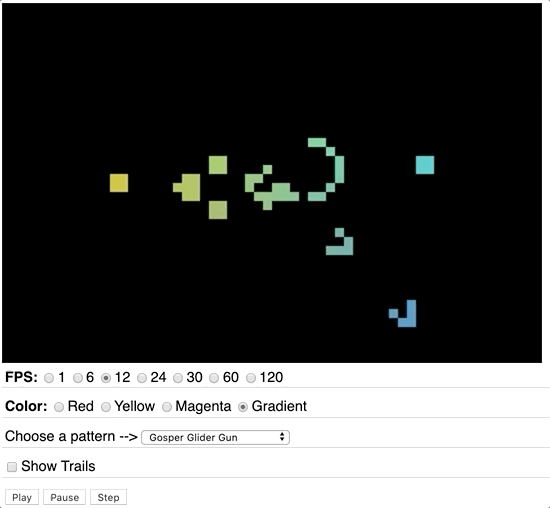

# Project 1 - *Interactive Sandbox* (DRAFT):

[I. Overview](#overview)

[II. Theme & Impact](#theme)

[III. Media](#media)

[IV. Code](#code)

[V. User Experience](#user-experience)

[VI. Examples](#examples)

[VII. Rubric](#rubric)

[VIII. Submission](#submission)

<a id="overview"/>

## I. Overview

***\*\*Note: the description and rubric of this project will be complete and assigned on Tuesday 1/28/2020 (beginning of week 3)\*\****

***\*\*Prior to that date, it's not too early to think about what you'd like to make!\*\****

You will create a compelling interactive media experience that allows the user to explore a media-related theme (of your choice)

<a id="theme"/>

## II. Theme & Impact
- Explore **one** of the *themes* that we covered in class:
  - Randomness:
    - Random walks --> see [HW-random-walker.md](https://github.com/tonethar/IGME-330-Master/blob/master/notes/HW-random-walker.md)
  - Dynamical Systems:
    - Chaotic Systems --> see [HW - Lorenz Attractor](https://github.com/tonethar/IGME-330-Master/blob/master/notes/HW-lorenz-attractor.md)
    - Periodic functions --> see [HW - Sine Wave](https://github.com/tonethar/IGME-330-Master/blob/master/notes/HW-sine-wave.md)
    - Phyllotaxis --> see [HW - Algorithmic Botany](https://github.com/tonethar/IGME-330-Master/blob/master/notes/HW-algorithmic-botany.md)
    - Perlin Noise --> RESOURCES: Coding Train [Coding Challenge #136.1: Polar Perlin Noise Loops](https://www.youtube.com/watch?v=ZI1dmHv3MeM) & [Noisejs](https://github.com/josephg/noisejs)
  - Emergence:
    - Life (IGME-330 video coming soon)
    - Reaction Diffusion --> RESOURCE: Coding Train [Coding Challenge #13: Reaction Diffusion Algorithm in p5.js](https://www.youtube.com/watch?v=BV9ny785UNc&t=1431s)
  - or ??? (getting permission in advance is required) - here are some ideas:
    - Generative Art - here's a great blog post to give you some ideas --> https://www.artnome.com/news/2018/8/8/why-love-generative-art
    - Particle systems/falling sand app: https://github.com/pineapplemachine/websand
    - https://medium.com/better-programming/heres-what-i-learned-from-30-days-of-creative-coding-a-codevember-retrospective-8c05a8497d24
    - [Intro to Creative Coding](https://github.com/mattdesl/workshop-p5-intro/blob/master/README.md)
    - Shiffman, of course: https://www.youtube.com/user/shiffman/featured
- *Impact:*
  - This app is an *interactive sandbox*, similar to a physical sandbox where the user can experiment, create and destroy with no given objective
  - The app must do something that would be meaningful to the user, allowing them to explore the chosen theme in a compelling way
  - The creator of this app should take this assignment seriously ("engage"!) and do their **best work**
  - Here are some examples of the reverse (e.g. these are *counter examples* to be avoided):
    - doing the minimum on many elements of the rubric below - for example, writing *exactly* 3 utility functions, creating *exactly* 3 controls, using exactly 3 semantic HTML elements, having exactly 5 CSS style rules ... - rather than letting the amount of these to be driven by what the app requires to work well and look good
    - copying/pasting CSS styles and layout from the demos and exercises, rather than creating their own
    - mimimal modification/extension of the in-class code that was provided
    
<a id="media"/>

## III. Media
- Procedural drawing via the [CanvasRenderingContext2D](https://developer.mozilla.org/en-US/docs/Web/API/CanvasRenderingContext2D) that we have been utilizing in class (e.g. Processing, Pixi.js, WebGL et al are NOT allowed):
  - canvas methods must be used for rectangles, arcs and lines
  - `ctx.save()` and `ctx.restore()` must be used
  - avoid using of convenience methods such `ctx.fillRect()` and `ctx.strokeRect()`
- HTML:
  - use semantic HTML where possible - `<header>`, `<footer>`, `<main>`, `<section>` (use at *least* 3 of these)
- CSS:
  - use an external CSS style sheet with at least 5 rules ("mobile friendly" CSS would be nice, but is not required)
  - an embedded font (ex. Google Fonts) is required
- Images:
  - if you end up using images, be sure that they are saved in a web-friendly format (JPEG, PNG or GIF) and *optimized* for web delivery. This means that their resolution (pixel dimensions) and file size are no larger than necessary.

<a id="code"/>

## IV. Code

### IV-A. File Naming Conventions
- The app file name is **index.html**
- Most of the app's code is in a file named **index.js**, which is linked from **index.html**
  - Most of the rest of the app's code is in your "User-created JS library" (see below)
- 

### IV-B. Coding standards
- `"use strict";` at the top of every JS file
- `let` and `const` only. `var` is NOT allowed
- For DOM traversal, `document.querySelector()` and `document.querySelectorAll()` only. `document.getElementById()`, `document.getElementsByTagName()`, `document.getElementByClassName()` etc are NOT allowed
- Avoid ["magic numbers"](https://en.wikipedia.org/wiki/Magic_number_(programming)#Unnamed_numerical_constants) and instead declare these values as variables or constants
- "inline" event handlers - ex. `<button onclick="doStuff();">My Button</button> are NOT allowed

### IV-C. User-created JS library
- we did this in class - see "Screen Saver With Controls-5" and "Screen Saver With Controls-6" linked at the bottom of [week-02A-notes.md](../weekly/week-02A-notes.md)
- the file - named `abcLIB.js` - where `abc` are your initials - will:
  - contain some or all of utility functions that we created in class (such as `getRandomColor()`, `getRandomInt()`, `drawRectangle()` etc ...)
  - contain at least 3 (and probably more) useful utility functions that were **created by you**
  - these functions are contained in an IIFE (as was shown in the videos)
  - these functions will be exported to a global object named `abcLIB` - where `abc` are your initials (as was shown in the videos)
  - as "utility" functions these must be "pure functions" - [Wikipedia - Pure Function](https://en.wikipedia.org/wiki/Pure_function) - see #1 and #2 in the definition
  
### IV-D. ES6 Class
- the app must utilize at least one [ES6 class](https://developer.mozilla.org/en-US/docs/Web/JavaScript/Reference/Classes)

### IV-E. Third-party libraries
- NOT allowed without advance approval
  
<a id="user-experience"/>

## V. User Experience
- Text Content:
  - title the app - in a &lt;title> element (this helps with bookmarking and search engines)
  - title the app - in an &lt;h1></h1> element, probably using an embedded font
  - a description of what theme the project is exploring
  - instructions on how to use the app
  - if needed, use the `title` attribute of HTML elements to provide tooltips to the user
- Controls:
  - *At least* 3 distinct DOM controls that have a **meaningful effect on the experience** by allowing the user to adjust various parameters of the experience, in at least 2 of the following categories:
    - buttons (pause and play buttons DO NOT count towards this requirement)
    - sliders
    - pulldowns
    - radio buttons
    - checkboxes
  - Mouse interaction would be a nice plus, but is not required

<a id="examples"/>

## VI. Examples

### Spiral Generator (Procedural flower petal generation - *phylotaxis*)

### Conway's Game of Life

<a id="rubric"/>

## VII. Rubric
  
  Your project will be graded on the following criteria:

| Criteria | Weight | Your Score |
| -------- | ------ | ---------- |
| **A. [Overall Theme/Impact](#theme)** | **50** | |
|    - Does the app have an coherent and identifiable theme? | |
|    - Does the app work as intended and visually engaging? | |
|    - Does the app functionality and programming go beyond what we did in class? | |
|    - Is the app at least *approaching/approximating* "portfolio quality" that you would not hesitate to show a potential employer? | |
|    **Overall:** Excellent/Outstanding (A+ = 50/50), Very Good (A = 45/50), Good (40/50), Fair (25-35/50), Poor (15-25/50), Unacceptable (0-15/50) ||
| **B. [User Experience](#user-experience)** | **20** | |
|    1. Has required controls | |
|    2. Runs without errors | |
|    3. Starts in a pleasing state | |
|    4. Visual design is pleasing (or at a minimum, "not ugly") | |
|    5. Widgets are well labeled and follow interface conventions | |
|    6. Users should be able to figure out how to use the app with minimal instruction | |
|    - *Missing controls* | *(-5 each)* |
|    - *Errors* | *(-? depending on severity)* |
|    **Overall:** You *should* aim to score 20/20 in this category ||
| **C. [Media](#media)**  | **15** | |
|    1. Valid HTML | |
|    2. Valid CSS | |
|    3. Images properly optimized | |
|    - *Majority of CSS not in external file* | *(-5)* |
|    - *Missing required semantic HTML elements* | *(-5)* |
|    - *Missing an embedded font* | *(-5)* | |
|    - *Images not properly optimized* | *(-5)* | |
|    **Overall:** You *should* aim to score 15/15 in this category ||
| **D. [Code](#code)**  | **15** | |
|    1. *Standards NOT followed (per incident)* | *(-1 to -5)* |
|    2. *Inline event handlers used* | *(-5)* |
|    3. *Missing ES5-style/IIFE Library* | *(-10)* | |
|    **Overall:** You *should* aim to score 15/15 in this category ||
| **Possible Total Points** | **100** | |
| **Deductions** | **&darr; Don't lose points for any of these! &darr;** | |
| *Deduction if required prototype is not submitted to dropbox on time* | *(-10)* | |
| *Deduction if final and complete documentation is not submitted to dropbox on time* | *(-10)* | |

<a id="submission"/>

## VIII. Submission
- Documentation is required and consists of:
  - ...
- See dropbox for deliverables and due dates
